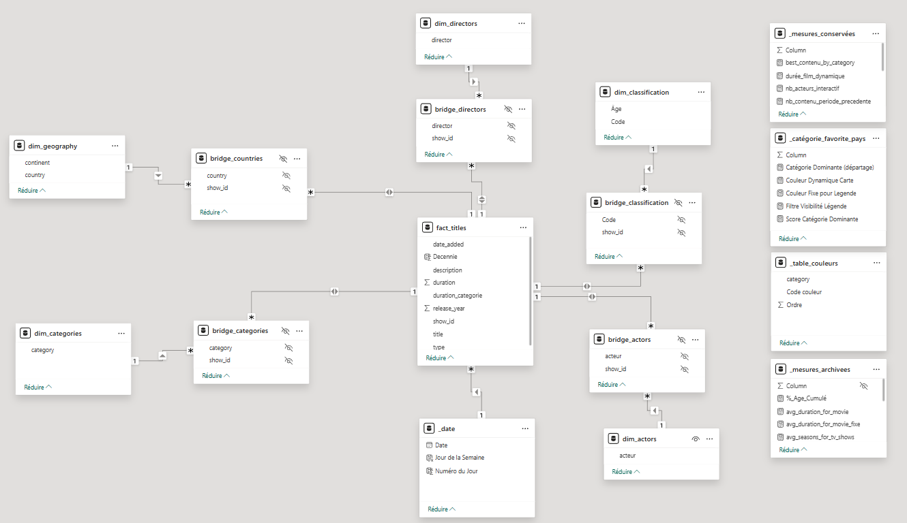
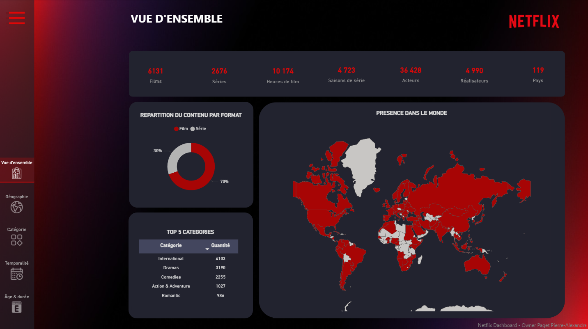
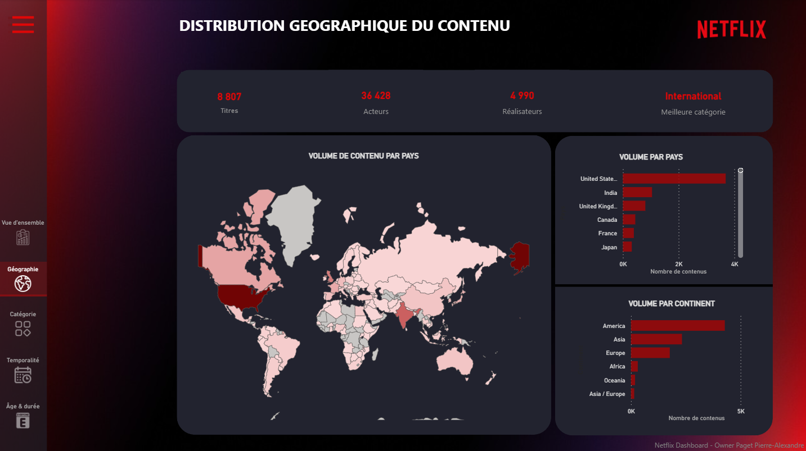
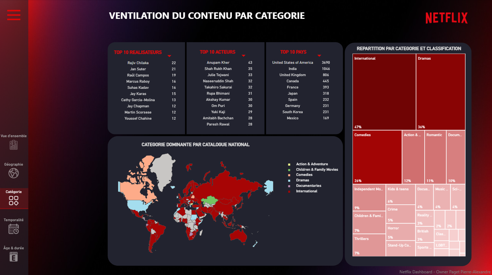
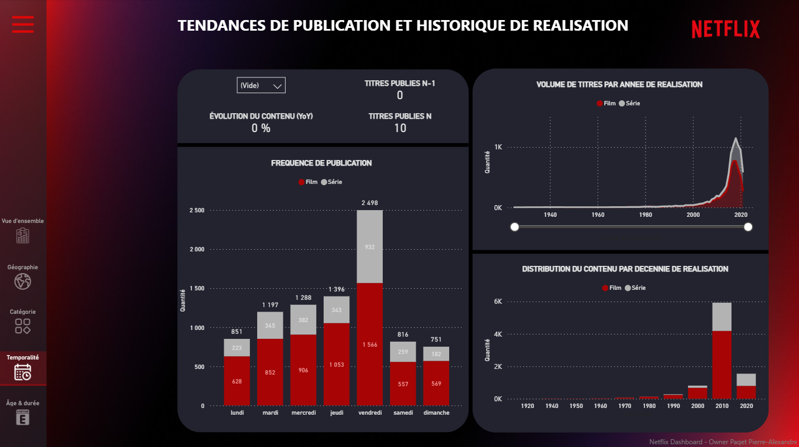
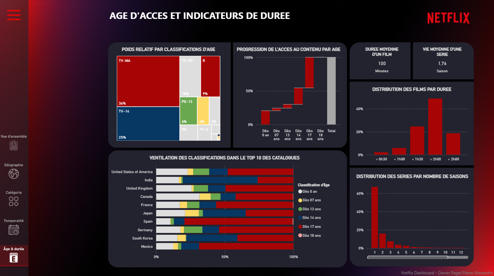

# Netflix Data Analysis – Dashboard
### Projet Data Analysis – Data Visualisation & Business Intelligence

---

## Sommaire
- [Netflix Data Analysis – Dashboard](#netflix-data-analysis--dashboard)
    - [Projet Data Analysis – Data Visualisation \& Business Intelligence](#projet-data-analysis--data-visualisation--business-intelligence)
  - [Sommaire](#sommaire)
  - [Contexte](#contexte)
  - [Problématique](#problématique)
  - [Objectifs du projet](#objectifs-du-projet)
  - [Sources des données](#sources-des-données)
  - [Technologies utilisées](#technologies-utilisées)
  - [Architecture du projet](#architecture-du-projet)
  - [Modélisation \& Architecture Data](#modélisation--architecture-data)
  - [Description du dashboard Power BI](#description-du-dashboard-power-bi)
    - [1. Vue d'ensemble](#1-vue-densemble)
    - [2. Distribution géographique](#2-distribution-géographique)
    - [3. Ventilation par catégorie](#3-ventilation-par-catégorie)
    - [4. Tendances de publication](#4-tendances-de-publication)
    - [5. Âge d'accès et durée](#5-âge-daccès-et-durée)
  - [Résultats clés](#résultats-clés)
  - [Limites du projet](#limites-du-projet)
  - [Perspectives d’évolution](#perspectives-dévolution)
  - [Licence](#licence)

---

## Contexte
Ce projet a été réalisé dans le cadre d’un travail personnel en **data analysis**, avec pour objectif d’explorer et de visualiser le catalogue de la plateforme **Netflix**.

Netflix est l’une des plus grandes plateformes de streaming au monde. Son succès repose sur la richesse de son catalogue, la diversité de ses contenus et leur adéquation avec les attentes des utilisateurs. L’analyse de ces données permet de mieux comprendre la structure du catalogue, son évolution dans le temps et sa répartition par type de contenu, genre et zone géographique.

---

## Problématique
**Comment se structure le catalogue Netflix et quelles tendances peut-on observer en termes de contenus, de format et de répartition géographique ?**

---

## Objectifs du projet
Construire un **dashboard Power BI clair, interactif et exploitable**, structuré autour de plusieurs axes stratégiques :
- **Analyse globale** : Volume de titres, typologie (Film vs Série), capital humain (acteurs/réalisateurs).
- **Géographie** : Identification des épicentres de production et répartition par continent.
- **Catégorisation** : Analyse de la diversité des genres et identification de la "Catégorie Reine" locale.
- **Temporalité** : Étude de la saisonnalité de publication et de l'historique de croissance.
- **Accessibilité** : Segmentation du catalogue par restriction d'âge et analyse des spécificités culturelles.

---

## Sources des données
- **netflix_titles.csv** : Fichier principal contenant les métadonnées des 8 800 titres (Kaggle).
- **classification.xlsx** : Enrichissement manuel pour corréler les codes de restriction (TV-MA, PG-13...) à un âge minimum.
- **list-pays-continents.xlsx** : Mapping permettant d'agréger les données pays par continent.
- **world_map.json** : Fichier TopoJSON personnalisé pour une visualisation cartographique plus esthétique et précise.

---

## Technologies utilisées
- **Visualisation / BI** : Power BI (Power Query pour l'ETL).
- **Langage** : DAX (Mesures calculées et intelligence temporelle).
- **Versioning** : Git / GitHub.

---

## Architecture du projet
```text
NETFLIX/
├── data/
│   ├── netflix_titles.csv
│   ├── classification.xlsx
│   └── liste_pays_continents.xlsx
├── scripts/
│   └── world_map.json
├── visualisations/
│   ├── power_bi/
│   │   ├── modele_relationnel.png
│   │   └── projet_netflix.pbix
│   └── screenshots/
│       ├── overview.png
│       ├── geographie.png
│       ├── categorie.png
│       ├── temporalité.png
│       └── age_duree.png
├── README.md
└── .gitignore
```

---

## Modélisation & Architecture Data


Le projet s’appuie sur un schéma en flocon optimisé pour la performance et l'interactivité :

- **Tables Bridges** : Utilisation de tables de ponts pour gérer la multi-appartenance (ex: un film associé à plusieurs pays ou plusieurs acteurs) afin d'éviter les doublons de comptage.
- **Bidirectionnalité contrôlée** : Configuration de relations bidirectionnelles entre la table de faits (`fact_titles`) et les bridges pour permettre un filtrage croisé dynamique tout en préservant l'intégrité du modèle.
- **Mesures DAX Avancées** : Création de mesures pour le taux d'évolution YoY, la hiérarchie de dates dynamique et l'identification de la catégorie majoritaire par territoire.

---

## Description du dashboard Power BI

### 1. Vue d'ensemble



Cette page constitue le centre de pilotage du rapport pour identifier l'ADN de la plateforme.
- **KPIs** : Nombre total de titres, d'acteurs, de réalisateurs et durée moyenne.
- **Répartition par format** : Segmentation Films (70%) vs Séries (30%).
- **Top 5 catégories** : Visualisation des piliers thématiques du catalogue.


### 2. Distribution géographique

Analyse de la présence mondiale sous l'angle du volume de production.
- **Heatmap mondiale** : Intensité du catalogue par pays.
- **Focus Continent** : Révèle que l'Asie et l'Europe sont les deux moteurs de croissance derrière l'Amérique du Nord.
- **Top Pays** : Classement mettant en évidence la domination des USA et la force de l'Inde.


### 3. Ventilation par catégorie

Exploration de la diversité thématique et des préférences locales.
- **Treemap des catégories** : Domination du genre "International" et des "Drames".
- **Mesure "Catégorie Reine"** : Visualisation cartographique du genre le plus représenté par pays.
- **Objectif** : Aider les équipes de programmation à adapter les acquisitions aux goûts spécifiques de chaque territoire.


### 4. Tendances de publication

Analyse de l'historique et des rythmes de mise en ligne.
- **Taux d'évolution (YoY)** : Chiffrage de l'explosion du catalogue (ex: +423% en 2016).
- **Saisonnalité** : Identification du vendredi comme jour de sortie stratégique pour capturer l'audience du week-end.
- **Drill-down** : Hiérarchie de dates permettant de passer d'une vue annuelle à une vue granulaire (mois/jour) en un clic.


### 5. Âge d'accès et durée

Segmentation marketing par restriction d'âge et formats techniques.
- **Graphique en cascade (Waterfall)** : Analyse de la maturité de l'offre.
- **Insights Marketing** : Constat que 50% du contenu cible les 14-17 ans et plus.
- **Contraste Culturel** : Comparaison de l'accessibilité précoce en Inde vs le verrouillage plus strict en Espagne.

---

## Résultats clés
- **Transition Industrielle** : Entre 2015 et 2020, Netflix est passé de diffuseur à producteur industriel, avec un pic historique d'intégration de contenus en 2016.
- **Stratégie Local-to-Global** : La prédominance du genre "International" valide la stratégie de production locale destinée à un rayonnement mondial.
- **Standardisation des lancements** : La donnée confirme une discipline rigoureuse de mise en ligne le vendredi pour maximiser le "Binge-watching" dès le week-end.
- **Censure Adaptative** : Le dashboard prouve que Netflix ajuste son catalogue non seulement aux goûts, mais aussi aux normes culturelles et législatives de chaque pays.

---

## Limites du projet
- **Nature Statique** : Le dataset utilisé est une "photographie" à un instant T et ne reflète pas les fluctuations quotidiennes du catalogue réel.
- **Absence d'Audience** : Le modèle analyse l'offre disponible, mais ne contient pas les données de visionnage réel (heures streamées).
- **Manque de Qualitatif** : L'absence de notes utilisateurs ou critiques empêche de mesurer la qualité perçue du catalogue.
- **Angle Financier** : Sans les coûts de production/acquisition, le calcul de la rentabilité (ROI) n'est pas possible.

---

## Perspectives d’évolution
- **Corrélation Qualité/Volume** : Intégrer les notes IMDb/Rotten Tomatoes pour identifier si les genres les plus produits sont aussi les mieux notés.
- **Analyse de la Demande** : Croiser l'offre avec les volumes de visionnage réels pour détecter des opportunités de production sur des niches sous-exploitées.
- **Optimisation Financière** : Injecter les budgets pour passer d'une gestion de catalogue à une véritable stratégie de rentabilité financière.

---

## Licence
Projet réalisé à des fins pédagogiques, utilisant exclusivement des données publiques.